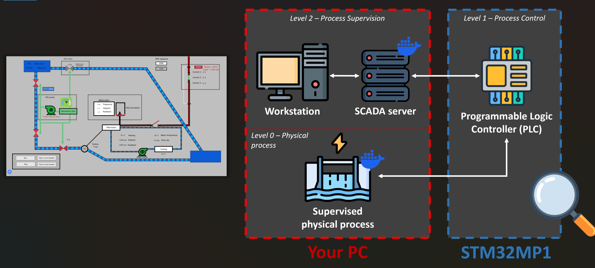
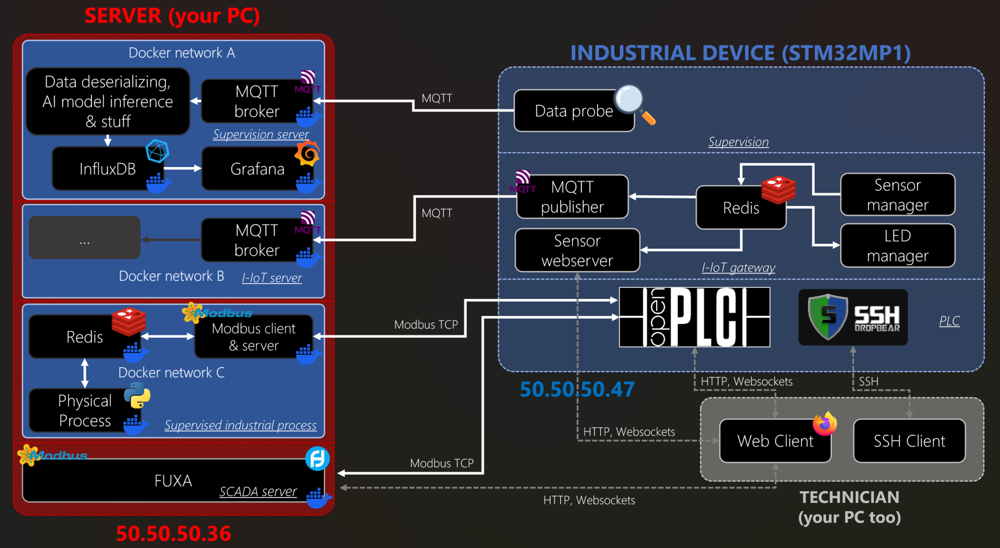
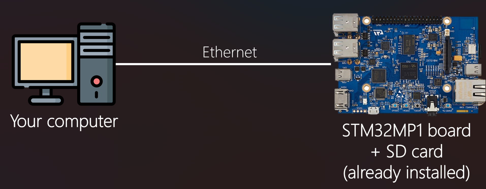
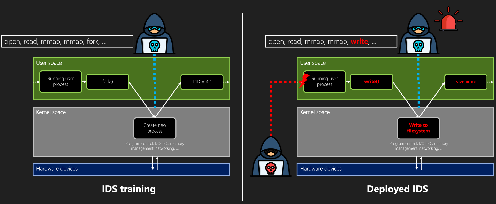

# ⚡🛡️ Breaking Into The AI-protected Realm: A Practical Session on (pen)testing Embedded Targets with AI-based Endpoint Detection and Response (EDR)
>
> By [Lalie Arnoud](https://www.linkedin.com/in/laliea/) 👽 & [Ulysse Vincenti](https://www.linkedin.com/in/ulysse-vincenti/) 🥷.

> This workshop was created for a session at the 2025 edition of the [GreHack](https://grehack.fr/) conference.

The goal of this workshop is to present the capabilities of a basic Machine Learning (ML)-assisted Intrusion Detection System (IDS) for the protection of industrial control systems.
This IDS is deployed on a Programmable Logic Controller (PLC) and relies on host signals to detect malicious actions on this device, giving an anomaly score to device's behavior every 2 seconds for the last 2 seconds time window.
The PLC is in charge of the proper operation of electricity generation at a hydroelectric dam station.



We consider that an attacker (you) has managed to gain access to the same network as this industrial controller, which is a critical scenario, but which has already been seen several times in real-world facilities.

**Your mission, if you accept it, will be to find the 2 flags hidden on the target while limiting detection by the IDS.**

Here are the details of services running on each of the machines involved in this exercise:



## 🧰 Hardware Requirements

To set it up, the following hardware is required:

- A computer running Linux, with Docker and an Ethernet port (has been tested on Ubuntu 22.04, Ubuntu 24.04, Debian 13, and NixOS 25.05)
- An STM32MP1 board (given), optionally paired with a Sense HAT add-on board (also given)
- A USB-C cable
- An Ethernet cable

## 🛠️ Setting up the environment

> [!NOTE]
> If, at any time, something is not happening as expected or if you're a little bit lost, don't hesitate to call us, we will be happy to explain again :)

1. Power up the given STM32MP1 board by connecting its power USB-C port to your computer
2. Connect it via Ethernet to a network you control or directly to your Ethernet port

3. Give yourself the correct IP address and subnet:

```bash
sudo ifconfig <eth_interface> 50.50.50.36/24
# or
sudo ip a add 50.50.50.36/24 dev <eth_interface>
```

4. Let the board start (~30sec) and try to ping it:

```
ping 50.50.50.47
```

> [!NOTE]
> You should now be able to get a PONG response from the board.
> If it is not the case, please call us.

Now that the board is set up, let's configure server-side services.
From your computer:

```bash
# Clone this repository
git clone git@github.com:LalieA/Workshop_AI_Protected_Realm.git

# Build and deploy server-side services
cd servers
sudo docker compose up --build
```
<!-- You should now be able to access the OpenPLC service at `http://50.50.50.47:8080`. -->

You deployed and should be able to access to:

- the **Supervision Server**, responsible for retrieving data sent by the board and running inferences of the ML model that computes anomaly scores.
  - `http://localhost:3000` (Grafana)
    - username : `admin`
    - password : `admin`
- the **I-IoT Server**, responsible for retrieving data sent by the board for Industrial IoT operations (giving data from environmental sensors like pressure, temperature, humidity).
  - we removed all server-side processing for this because it is useless for this workshop.
  - a webserver is embedded on the PLC to view gathered data, accessible at: `http://50.50.50.47:5000`
- the **SCADA Server**, which communicates with the PLC to enable real-time visualization and control of the state of the hydroelectric process.
  - `http://localhost:1881` (FUXA)
  - Visuals need to be configured at the first start:
    - 1. click the blue button on bottom-left and select "Editor"
    - 2. click on the floppy disk icon on top-left and select "Open project".
    - 3. select the `hydro_FUXA.json` file in this `servers/` directory.
    - 4. re-click on the blue button on bottom-left and select "Home"
- the **Industrial Process Simulator**, which simulates all sensors and actuators to reproduce the hydroelectric dam use case (...and which allows you to break everything without having to overflow a real dam).
  - nothing to access here, just some python scripts running.

> [!IMPORTANT]
> The last thing to do is to enable the PLC to run. Call us when you have completed this step so we can start the PLC.

> [!WARNING]
> It may happen that the physical process simulator is a little out of sync, especially when the PLC is not started immediately. If this happens, it is best to leave the Docker Compose servers running and restart only the simulator using `cd servers && sudo docker compose restart process_simu` from another terminal.

So, everything's ready now! How about we get down to business?

## 📜 The rules

1. Suppose you do not have physical access to the device.
2. Do not try to attack things on your computer (industrial process simulator, AI & supervision stuff, ...), that's useless and not the goal of the workshop.
3. Enjoy!

## 💻 Ok, then where do I start?

Well, we've heard that the technician who maintains industrial devices in this facility is often called `techi`...

> [!NOTE]
> The anomaly detection model used is a fairly standard ML model, designed for demonstration purposes. As such, it may generate false alarms, just as it may fail to detect your actions.

 **Your turn!** 🕺💃

## 📚🧠 Going further: the intrusion detection model

The presented Host-based Intrusion Detection System (HIDS) relies on system calls to monitor patterns of low-level actions executed on the system. This is valuable data for intrusion detection because it is nearly impossible for an attacker to infiltrate a system without raising even a single system call. Each system call, such as file access, process creation, or network communication, is represented by its identifier: fork (syscall #2), read (#3), write (#4), open (#5), close (#6), etc.



System calls made across the entire system are retrieved during execution and divided into 2-second sequences, corresponding to all system calls that occurred within a 2-second time window.
- [3-gram](https://en.wikipedia.org/wiki/N-gram), e.g. unique contiguous sequences of 3 system calls, are constructed for each sequence.
- For each 3-gram, [TF-IDF](https://en.wikipedia.org/wiki/Tf%E2%80%93idf) (Term Frequency - Inverse Document Frequency) is computed. This value increases with the frequency of the 3-gram in the sequence (TF), but decreases with the frequency of that 3-gram across all sequences (IDF), thus emphasizing frequent but distinctive patterns.
The 3-gram TF-IDF vectors derived from system calls sequences are used as input for an [Isolation Forest](https://en.wikipedia.org/wiki/Isolation_forest) algorithm, which is responsible for assigning an anomaly score between 0 (normal) and 1 (abnormal) to the system's behavior over the last 2 seconds.


Data from 4 normal runs of the PLC, each lasting 4 hours, was used to create a training set for the intrusion detection model. When the IDS is deployed, the model processes system call sequences and computes anomaly scores, triggering an alert when the score exceeds a threshold.


By focusing on dynamic analysis of system call patterns rather than static signatures, this type of IDS is able of detecting attacks that alter system control flow, even those exploiting 0-day vulnerabilities.

However, this IDS is inherently vulnerable to [**mimicry attacks**](https://people.eecs.berkeley.edu/~daw/papers/mimicry.pdf) since it relies solely on system call identifiers. An attacker could therefore hide their behavior in a sequence of system calls designed to be recognized as legitimate by the IDS, for example by deliberately causing some system calls in the sequence to fail.

Machine learning algorithms help solve problems, but they also bring new ones. For instance, it can be difficult to explain anomaly scores: why does one sequence of system calls have a slightly higher score than another? This falls within the realm of [**Explainable AI**](https://en.wikipedia.org/wiki/Explainable_artificial_intelligence).
Then, forensic mechanisms are needed around this IDS to provide more context for an alert: processes involved, resources potentially targeted, etc.
AI can also be resource consuming and is hardly integratable as is, especially on embedded systems. [**Pruning**](https://en.wikipedia.org/wiki/Pruning_(artificial_neural_network)), [**quantization**](https://huggingface.co/docs/optimum/concept_guides/quantization), and [**distillation**](https://www.ibm.com/think/topics/knowledge-distillation) techniques can be used to address these problems.
In addition, AI models also bring their own vulnerabilities, primarily in the supply chain through [**data poisoning**](https://www.ibm.com/think/topics/data-poisoning), where an attacker could modify the training dataset of the detection model so that its behavior is learned as normal, and then through [**adversarial attacks**](https://www.paloaltonetworks.com/cyberpedia/what-are-adversarial-attacks-on-AI-Machine-Learning), where a second AI model could be trained to build sequences that are recognized as legitimate by the targeted detection model.

Finally, AI or not, the implementation of the IDS can make it still vulnerable to classic EDR evasion techniques such as [bypassing the system call hooking](https://matheuzsecurity.github.io/hacking/evading-linux-edrs-with-io-uring/) mechanism.

## 🌟 Acknowledgements

This workshop is based on the [HENDRICS](https://github.com/CEA-Leti/HENDRICS) open-source platform, released by the [CEA-Leti](https://www.leti-cea.fr/cea-tech/leti) and developed as part of the [PEPR Cybersécurité](https://www.pepr-cybersecurite.fr/) [SuperviZ project](https://superviz.inria.fr/) and [IRT Nanoelec](https://irtnanoelec.fr/).

## Credits

Images illustrating the architecture and operation of the devices involved in this workshop were created using [Flaticon.com](https://www.flaticon.com/) resources.

## License

This project is licensed under the GNU General Public License v3.0 (GPLv3).
See the [LICENSE](./LICENSE) file for full details.
